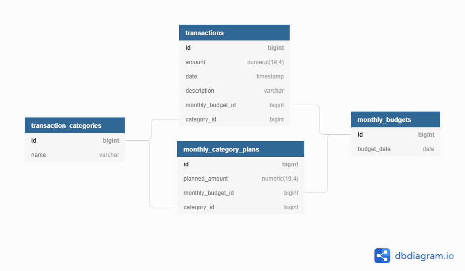

# TAZB Dev Log

## 02. Database Design

After initial planning, I will design the database. I am going to keep this design as simple as possible. Each table
will have a single bigint as its primary key. I do NOT want to over-engineer this from the start; however, as I describe
the database design, I will mention places where more structure may improve the design.

The first thing I need is a list of monthly budgets. Each budget will have N categories. Each category will have 1
amount. An example of this would be, in December, I will spend $800 on groceries and $150 on car insurance. 

To represent this I created two tables the monthly_budgets table and the monthly_category_plans table. The
monthly_budgets table has only a single column to represent the budget_date. The monthly_category_plans table will
contain the categories and their associated amounts with a foreign key on the monthly_budgets table. The foreign key is
trying to ensure that a category cannot exist unless it is tied to a monthly budget. Already there may be problems with
this design. 

Representing a monthly budget (Year and Month without Day) in PostgreSQL is difficult. After researching, I narrowed it
down to two choices:

1. Use a date column and always set the Day to 1 in the application code.
1. Use two columns, one for month and one for year.

The first approach will allow me to use the LocalDate type in my code. This will make working with dates, especially
date math, much easier. The down-side is, always using a 1 for the day is not enforced by the database.

With the second approach, I would have a true representation of a monthly budget. I would not need to 'know' that the
day should always be set to 1, because there is no day. The downside is, I would be working with ints in my entities.
Reasoning about dates would be more difficult because they are represented as integers.

In the end, I chose the first approach for the following reasons:

1. It is simpler.
1. Spring Data JPA has multiple ways to set the day column to 1 when writing to the database.
1. I am likely the only developer that will ever work on this project, so I don't need to worry about other people
   'forgetting' that monthly budgets are always on the first day of the month.

With these two tables the 'planning' stage of our Zero-Based budgeting is complete. The user will be able to create
categories and assign values to them for each monthly budget.

The next step is to enter the transactions. This will allow the user to track how much money was actually spent in each
category. To represent that, I created a transactions table. It has non-nullable amount, and date fields because, at a
minimum, we must track how much was spent on which day. Then, there is the description field which can hold "Walmart POS
XX34983493848" type information about the transaction. Each transaction should also be tied to a monthly budget, so a
foreign key to the monthly budgets table was added. Also, each transaction should have a category and most-of-the-time
that category should match up to one of the categories in the monthly_category_plan table. To accommodate this I created
a transaction_categories table with a column to hold the categories. Then, I created a foreign key from transactions to
transaction_categories. I also created a foreign key from monthly_category_plans to transaction_categories. 

With this, a user should be able to track how much money is spent and apply those transactions to a category. As the
month goes on, they will be able to compare how much they planned to spend on a category with how much was actually
spent in each category.

In the future, I will likely want to add multiple users and the concept of different accounts. It is going to be
interesting to see how this design holds up when making these drastic changes.
