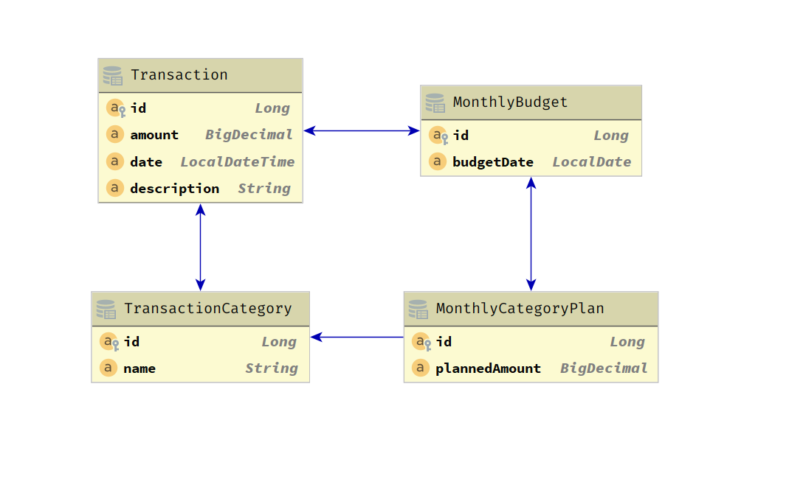

# TAZB Dev Log

## 03. Database, JPA Entities, and Flyway

After designing the database, I had to actually create the tables, columns, and constraints. I actually cheated, just a
bit; I first wrote the JPA Entities, then ran an @DataJpaTest integration test against a H2 database. On the H2
database, I allowed hibernate to automatically create the DDL. After the test ran, I would review the logs to see what
schema Hibernate generated. Then, I would then tweak the Entities until the schema that hibernate was generating matched
my design.

In the logs, Hibernate prints the SQL that it is running to generate the schema. Here is an example:

    Hibernate: drop table if exists monthly_budgets CASCADE 

    Hibernate: drop table if exists monthly_category_plans CASCADE 

    Hibernate: drop table if exists transaction_categories CASCADE 

    Hibernate: drop table if exists transactions CASCADE 

    Hibernate: drop sequence if exists hibernate_sequence

    Hibernate: create sequence hibernate_sequence start with 1 increment by 1

    Hibernate: create table monthly_budgets (id bigint not null, budget_date date not null, primary key (id))

    Hibernate: create table monthly_category_plans (id bigint not null, planned_amount decimal(19,4), monthly_budget_id
    bigint, transaction_category_id bigint, primary key (id))

    Hibernate: create table transaction_categories (id bigint not null, name varchar(24) not null, primary key (id))

    Hibernate: create table transactions (id bigint not null, amount decimal(19,4) not null, date timestamp not null,
    description varchar(500), monthly_budget_id bigint, transaction_category_id bigint, primary key (id))

    Hibernate: alter table monthly_budgets add constraint UK_gltw11hgpkj5w5rm8oxt7dbl7 unique (budget_date)

    Hibernate: alter table transaction_categories add constraint UK_eb4d863waknl32ywuuit6ggyd unique (name)

    Hibernate: alter table monthly_category_plans add constraint FK4yb846plxr52fv77v3gdc54nj foreign key
    (monthly_budget_id) references monthly_budgets

    Hibernate: alter table monthly_category_plans add constraint FKkoafjcxvj5hjbbxm535aeir8d foreign key
    (transaction_category_id) references transaction_categories

    Hibernate: alter table transactions add constraint FK1rfe8badd0cxyxet36g1geggp foreign key (monthly_budget_id)
    references monthly_budgets
    
    Hibernate: alter table transactions add constraint FKlm6gxlbye40uxfrsy31lms806 foreign key (transaction_category_id)
    references transaction_categories

Now you see why this is practically cheating. I kept adding annotations such as "nullable = false" and "length = 500"
until I arrived at the correct schema. At first, hibernate wanted to create association tables for all the ManyToOne
relationships. This isn't how I designed it. To get around this, I had to add @JoinColumn attributes. This told
hibernate, join these two entities on this column because it is the foreign key. After that, it was mostly just a matter
of copying the SQL statements into a ".sql" file, then tweaking the SQL to be PostgreSQL compliant.

There is one additional feature I wanted to add to PostgreSQL and a couple gotchas with this setup. The additional
feature that I wanted was for PostgreSQL to be case insensitive when comparing Strings. To do this, I had to create a
special collation and add that collation to all the varchar columns. Which leads to the gotcha.

The H2 database supports case-insensitivity, but not via a special collation. That means I cannot use the same SQL
script to generate the DDL in my application and in my integration tests (H2 database). This collation, was not the only
difference between H2 and PostgreSQL. There were some other differences; for example, the way the sequence works when
generating IDs is different. These differences are minor, but it does mean that there are subtle differences between the
database my integration tests run against, and "Prod." There are ways to fix this, but for now I have decided to create
two DDL scripts. One for PostgreSQL and one for H2. Then, I configured Flyway to use the PostgreSQL version when running
the application, and use the other version when running in the test project. This was achieved the same way using two
different DataSources is achieved, by having two separate application.yml files with two separate configurations.

This was my first time using Flyway. So far, it is working flawlessly. The integration with Spring Boot was very
straight-forward.

